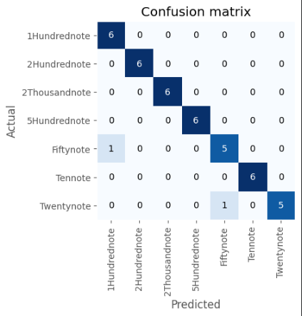
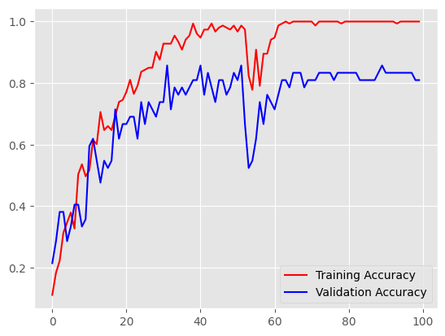
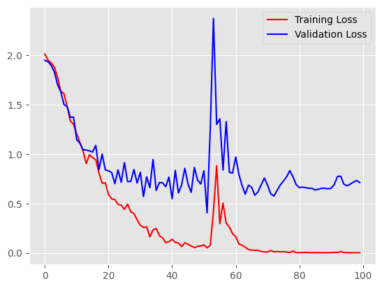

# 🏦 Indian Currency Note Classifier

> A deep learning system that classifies all 7 denominations of Indian Rupee notes using a **custom CNN** and **ResNet34 transfer learning**, achieving up to **95.24% validation accuracy**.




---

## 📌 Table of Contents
- [Overview](#overview)
- [Why This Is Hard](#why-this-is-hard)
- [Dataset](#dataset)
- [Models](#models)
- [Results](#results)
- [Project Structure](#project-structure)
- [Setup & Usage](#setup--usage)
- [Key Learnings](#key-learnings)
- [Future Work](#future-work)

---

## Overview

India's cashless transition has been gradual — currency recognition remains a real-world problem, especially for **visually impaired users** and **automated cash-handling machines**. This project builds and compares two approaches:

1. **Custom CNN from scratch** — trained for 100 epochs on 150×150 RGB images
2. **ResNet34 via FastAI** — transfer learning fine-tuned in just 10 epochs

The classifier covers all 7 denominations: ₹10, ₹20, ₹50, ₹100, ₹200, ₹500, ₹2000.

---

## Why This Is Hard

With only **~22 images per class**, this is a deliberate exercise in **low-data deep learning** — one of the most common real-world constraints practitioners face outside of Kaggle competitions.

The core challenges this project addresses:

- **Severe overfitting risk** — a model with 468K parameters trained on 153 images will memorize, not generalize
- **High inter-class visual similarity** — ₹100, ₹200, and ₹500 notes share color families and Gandhi's portrait
- **No augmentation baseline** — the raw CNN experiment intentionally avoids heavy augmentation to expose the overfitting gap and motivate the transfer learning approach
- **Class imbalance edge** — ₹2000 has 21 samples vs 22 for all others; small but worth noting in production systems

This constraint makes the **12% accuracy gap between CNN and ResNet34** the most interesting finding — not the final number itself.

---

## Dataset

**Source:** [Kaggle — Indian Currency Notes Classifier](https://www.kaggle.com/datasets/gauravsahani/indian-currency-notes-classifier)

| Denomination | Train Samples |
|---|---|
| ₹2000 | 21 |
| ₹500  | 22 |
| ₹200  | 22 |
| ₹100  | 22 |
| ₹50   | 22 |
| ₹20   | 22 |
| ₹10   | 22 |
| **Total** | **153 train / 42 test** |

> ⚠️ **Small dataset challenge:** With only ~22 images per class, overfitting and generalization are the central technical challenges — handled via Dropout, data augmentation, and transfer learning.

---

## Models

### 1. Custom CNN (`notebooks/currency_cnn.ipynb`)

Built using TensorFlow/Keras with a 4-block convolutional architecture.

```
Input (150×150×3)
→ Conv2D(32) → MaxPool → Conv2D(32) → MaxPool → Dropout(0.2)
→ Conv2D(64) → MaxPool → Conv2D(64) → MaxPool → Dropout(0.3)
→ Flatten → Dense(128, ReLU) → Dense(7, Softmax)
```

| Parameter | Value |
|---|---|
| Total Parameters | 468,007 (~1.79 MB) |
| Optimizer | Adam |
| Loss | Categorical Crossentropy |
| Input Size | 150×150 |
| Epochs | 100 |

---

### 2. ResNet34 via FastAI (`notebooks/currency_resnet34.ipynb`)

Pre-trained ResNet34 fine-tuned using FastAI's `cnn_learner`.

| Parameter | Value |
|---|---|
| Base Model | ResNet34 (ImageNet weights) |
| Input Size | 360×360 (Squish resize) |
| Freeze Epochs | 5 |
| Fine-tune Epochs | 5 |
| Learning Rate | 0.001 |

---

## Results

### Custom CNN — 100 Epochs

| Metric | Train | Validation |
|---|---|---|
| Best Accuracy | **100%** | **85.71%** |
| Final Accuracy | 100% | 80.95% |
| Final Loss | 0.0017 | 0.7120 |

> Training accuracy reached 100% by epoch ~64, but validation plateaued at ~83%, indicating overfitting on this small dataset — an expected behavior addressed in the ResNet approach.




### ResNet34 Fine-Tuning — Freeze Phase (5 epochs)

| Epoch | Train Loss | Valid Loss | Error Rate | Accuracy |
|---|---|---|---|---|
| 0 | 0.3265 | 0.3046 | 9.52% | 90.48% |
| 1 | 0.2540 | 0.2279 | 7.14% | 92.86% |
| 2 | 0.2112 | 0.1714 | 7.14% | 92.86% |
| 3 | 0.1602 | 0.1500 | 4.76% | 95.24% |
| **4** | **0.1383** | **0.1419** | **4.76%** | **95.24%** ✅ |

### Model Comparison

| Model | Val Accuracy | Params | Training Time |
|---|---|---|---|
| Custom CNN | 83.33% | 468K | ~100 epochs |
| **ResNet34 (FastAI)** | **95.24%** | ~21M | **10 epochs** |

---

## Project Structure

```
indian-currency-classifier/
│
├── notebooks/
│   ├── currency_cnn.ipynb          # Custom CNN from scratch
│   └── currency_resnet34.ipynb     # FastAI ResNet34 transfer learning
│
├── src/
│   ├── predict.py                  # Inference script (single image)
│   ├── train_cnn.py                # Training script for CNN
│   └── utils.py                    # Helper functions
│
├── assets/
│   ├── confusion_matrix.png        # ResNet34 confusion matrix
│   ├── training_curves_cnn.png     # CNN accuracy/loss plots
│   └── sample_predictions.png     # Sample output images
│
├── models/
│   └── README.md                   # How to download saved model weights
│
├── requirements.txt
├── LICENSE
└── README.md
```

---

## Setup & Usage

### 1. Clone the Repo
```bash
git clone https://github.com/YOUR_USERNAME/indian-currency-classifier.git
cd indian-currency-classifier
```

### 2. Install Dependencies
```bash
pip install -r requirements.txt
```

### 3. Download Dataset
```bash
pip install kaggle
kaggle datasets download -d gauravsahani/indian-currency-notes-classifier
unzip indian-currency-notes-classifier.zip
```

### 4. Run Inference
```bash
python src/predict.py --image path/to/note.jpg
```

### 5. Open Notebooks
```bash
jupyter notebook notebooks/
```

---

## `requirements.txt`

```
tensorflow>=2.10
fastai>=2.7
numpy
matplotlib
seaborn
Pillow
kaggle
jupyter
```

---

## Key Learnings

- **Transfer learning dominates on small datasets** — ResNet34 with 10 epochs outperformed a custom CNN trained for 100 epochs by ~12%.
- **Overfitting is real with ~22 samples/class** — The CNN memorized training data despite Dropout(0.2/0.3). Addressed via FastAI's built-in augmentations.
- **Learning rate matters** — `lr_find()` from FastAI identified an optimal LR of 0.001, leading to steady convergence without oscillation.
- **Model collapse at epoch 53–54** — The CNN training showed a spike in validation loss (2.37), likely from an unlucky batch. The model recovered, showing the importance of proper LR scheduling.

---

## Future Work

- [ ] Expand dataset using web scraping or GAN-based augmentation
- [ ] Add real-time webcam inference using OpenCV
- [ ] Deploy as a REST API using FastAPI + Docker
- [ ] Build a mobile app using TensorFlow Lite / CoreML
- [ ] Extend to detect **fake/counterfeit notes** using anomaly detection
- [ ] Add support for **older series** Indian currency notes

---

## License

This project is licensed under the MIT License. See [LICENSE](LICENSE) for details.

---

## Acknowledgements

- Dataset by [Gaurav Sahani on Kaggle](https://www.kaggle.com/datasets/gauravsahani/indian-currency-notes-classifier)
- [FastAI course](https://course.fast.ai/) — practical deep learning inspiration
- TensorFlow/Keras documentation

---

*Made with ❤️ to demonstrate end-to-end ML engineering — from raw data to model comparison.*